---
## Front matter
title: "Отчёт по лабораторной работе№4"
subtitle: "Создание и процесс обработки программ на языке ассемблера NASM"
author: "Курникова Елизавета Денисовна НБИбд-01-23"

## Generic otions
lang: ru-RU
toc-title: "Содержание"

## Bibliography
bibliography: bib/cite.bib
csl: pandoc/csl/gost-r-7-0-5-2008-numeric.csl

## Pdf output format
toc: true # Table of contents
toc-depth: 2
lof: true # List of figures
lot: true # List of tables
fontsize: 12pt
linestretch: 1.5
papersize: a4
documentclass: scrreprt
## I18n polyglossia
polyglossia-lang:
  name: russian
  options:
	- spelling=modern
	- babelshorthands=true
polyglossia-otherlangs:
  name: english
## I18n babel
babel-lang: russian
babel-otherlangs: english
## Fonts
mainfont: PT Serif
romanfont: PT Serif
sansfont: PT Sans
monofont: PT Mono
mainfontoptions: Ligatures=TeX
romanfontoptions: Ligatures=TeX
sansfontoptions: Ligatures=TeX,Scale=MatchLowercase
monofontoptions: Scale=MatchLowercase,Scale=0.9
## Biblatex
biblatex: true
biblio-style: "gost-numeric"
biblatexoptions:
  - parentracker=true
  - backend=biber
  - hyperref=auto
  - language=auto
  - autolang=other*
  - citestyle=gost-numeric
## Pandoc-crossref LaTeX customization
figureTitle: "Рис."
tableTitle: "Таблица"
listingTitle: "Листинг"
lofTitle: "Список иллюстраций"
lotTitle: "Список таблиц"
lolTitle: "Листинги"
## Misc options
indent: true
header-includes:
  - \usepackage{indentfirst}
  - \usepackage{float} # keep figures where there are in the text
  - \floatplacement{figure}{H} # keep figures where there are in the text
---

# Цель работы

Освоение процедуры компиляции и сборки программ, написанных на ассемблере NASM.

# Задание

Здесь приводится описание задания в соответствии с рекомендациями
методического пособия и выданным вариантом.

# Выполнение лабораторной работы

1. Создайте каталог для работы с программами на языке ассемблера NASM:

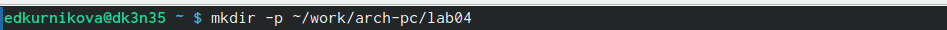{ #fig:001 width=90% }

2. Перейдём в созданный каталог:

{ #fig:002 width=90% }

3. Создадим текстовый файл с именем hello.asm:

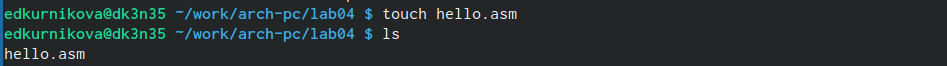{ #fig:003 width=90% }

4. Откроем этот файл с помощью текстового редактора

{ #fig:004 width=90% }

5. Введём в него текст:

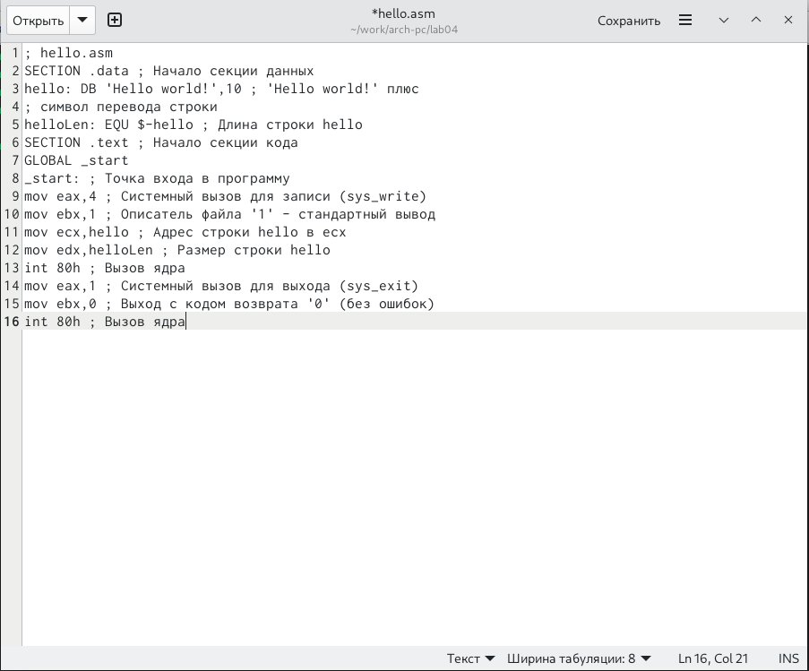{ #fig:005 width=90% }

6. Скомпилируем данный текст

{ #fig:006 width=90% }

7. Проверим, что объектный файл был создан:

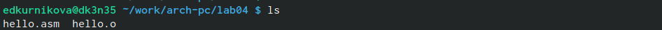{ #fig:007 width=90% }

8. Скомпилируем исходный файл hello.asm в obj.o  и создадим файл листинга list.lst

{ #fig:008 width=90% }

9. Проверим, что файлы были созданы.

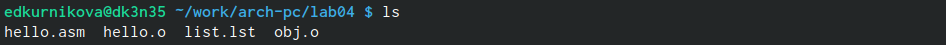{ #fig:009 width=90% }

10. Передадим объектный файл на обработку компоновщику.

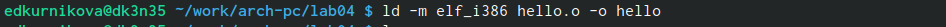{ #fig:010 width=90% }

11. Проверим, что исполняемый файл hello был создан.

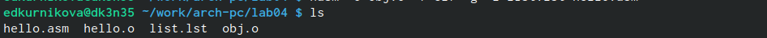{ #fig:011 width=90% }

12. Зададим имя создаваемого исполняемого файла.

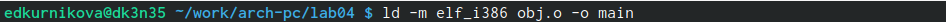{ #fig:012 width=90% }

13. Запустим на выполнение созданный исполняемый файл, находящийся в текущем каталоге.

{ #fig:013 width=90% }

14. Создадим копию файла hello.asm с именем lab4.asm

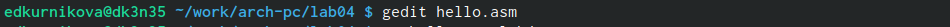{ #fig:014 width=90% }

15. Внесём изменения в текст программы в файле lab5.asm

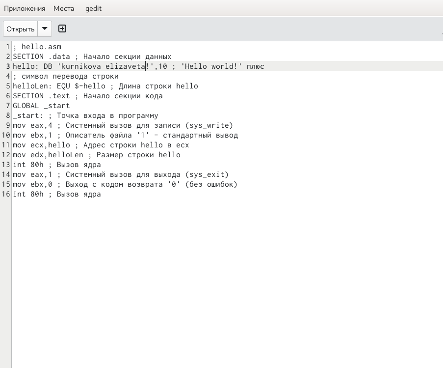{ #fig:015 width=90% }

16. Оттранслируем полученный текст программы lab5.asm в объектный файл. Выполним компоновку объектного файла и запустим получившийся исполняемый файл.

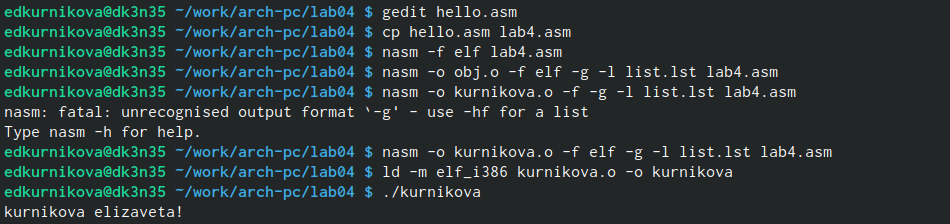{ #fig:016 width=90% }

17. Скопировала файлы hello.asm и lab4.asm в локальный репозиторий в ката-
лог ~/work/study/2023-2024/“Архитектура компьютера”/arch-pc/labs/lab04/ с
помощью утилиты ср и проверил наличие файлов с помощью утилиты ls

{ #fig:017 width=90% }

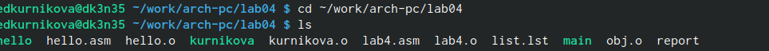{ #fig:017 width=90% }

18.  Загружаю файлы на Github

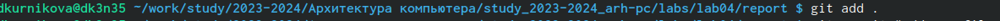{ #fig:018 width=90% }

{ #fig:018 width=90% }

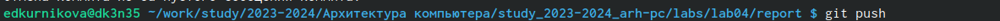{ #fig:018 width=90% }
# Выводы

В ходе выполнения работы, я освоила процедуры компиляции и сборки программ, написанных на ассемблере NASM.

